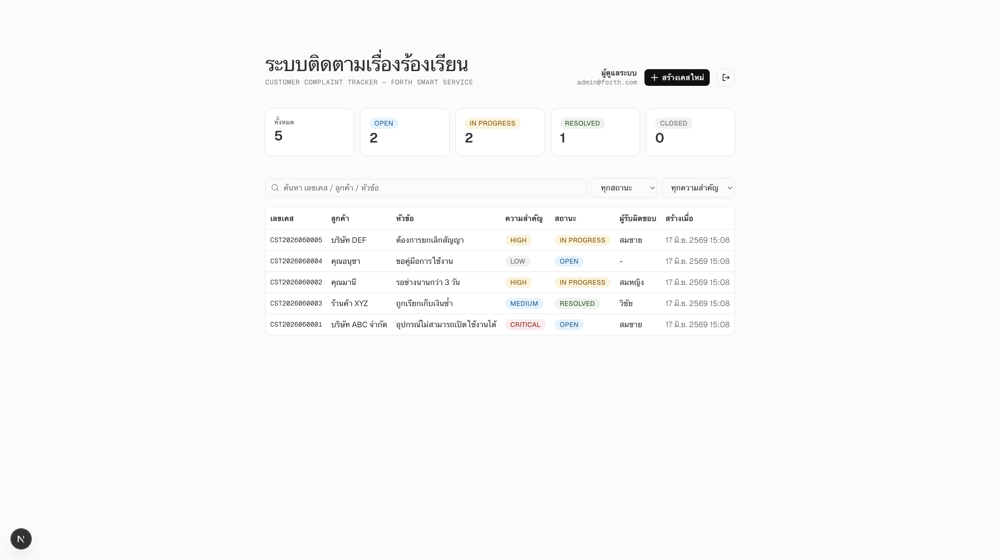
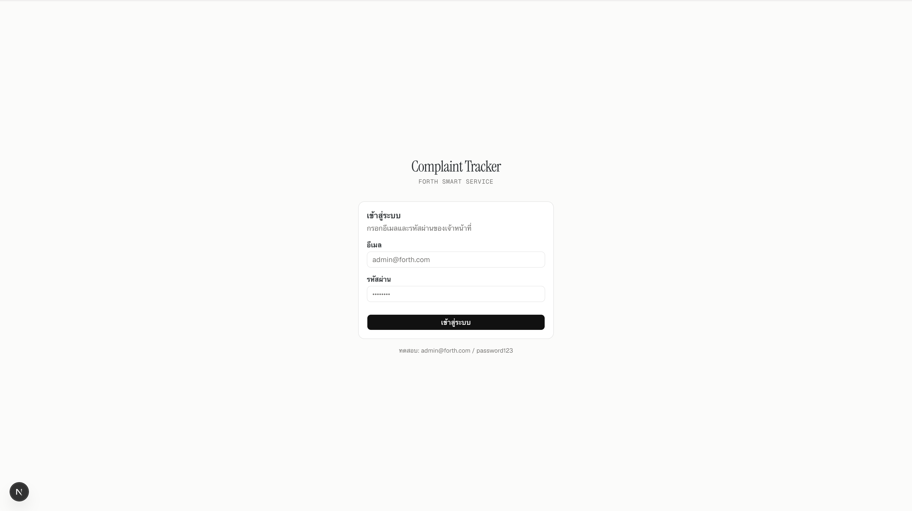

# Complaint Tracker

ระบบติดตามเรื่องร้องเรียนลูกค้า (Customer Complaint Tracker) — Forth Smart Service

Monorepo: **Next.js + shadcn/ui** (frontend) · **NestJS + Prisma + SQLite** (backend).

```
complaint-tracker/
├─ apps/
│  ├─ web/    Next.js 16 (App Router) + Tailwind v4 + shadcn/ui
│  └─ api/    NestJS 11 + Prisma 6 + SQLite
├─ bruno/     Bruno API collection (.bru ต่อ endpoint + env Local)
├─ docs/      screenshots ประกอบ README
├─ .claude/   skills/minimalist-ui — design system ของ frontend
├─ _legacy/   เวอร์ชันเดิม (Express + node:sqlite + vanilla JS) เก็บไว้อ้างอิง
├─ pnpm-workspace.yaml
└─ package.json
```

## Screenshots

### Dashboard


### Login


## Requirements

- Node.js ≥ 20
- pnpm ≥ 10

> หมายเหตุ: ในเครื่องนี้ `pnpm` จาก Homebrew (corepack shim) เสีย — ใช้ `~/Library/pnpm/pnpm` แทน
> (`export PATH="$HOME/Library/pnpm:$PATH"`).

## Setup

```bash
pnpm install            # ติดตั้ง deps ทั้ง workspace + generate Prisma Client
pnpm db:push            # สร้าง schema ลง SQLite (apps/api/complaints.db)
pnpm db:seed            # ใส่ user 2 คน + เคสตัวอย่าง 5 เคส
```

## Development

```bash
pnpm dev                # รัน web + api พร้อมกัน
# หรือแยก
pnpm dev:api            # NestJS  → http://localhost:3001/api
pnpm dev:web            # Next.js → http://localhost:3000
```

ตั้งค่า env:
- `apps/api/.env` — `DATABASE_URL`, `PORT` (3001), `CORS_ORIGIN`, `JWT_SECRET`, `JWT_EXPIRES_IN`
- `apps/web/.env.local` — `NEXT_PUBLIC_API_URL` (`http://localhost:3001/api`)

## Quality gates

```bash
pnpm typecheck          # tsc --noEmit (web)
pnpm lint               # eslint (web)
pnpm test               # jest (api)
pnpm build              # build api + web
pnpm check              # ทั้งหมดข้างบนเรียงกัน
```

## Testing

Unit test ฝั่ง API (Jest) — 26 tests (3 suites), mock `PrismaService`/`CasesService`/`UsersService`+`JwtService` ไม่แตะ DB จริง:

```bash
pnpm test                      # รัน api tests
pnpm --filter api test:cov     # + coverage (service/controller/dto ~100%)
pnpm --filter api test:watch
```

- `src/cases/cases.service.spec.ts` — business logic (case number, filter, stats, update, notes, 404)
- `src/cases/cases.controller.spec.ts` — delegation ไป service (override JwtAuthGuard)
- `src/auth/auth.service.spec.ts` — validateUser / login (mock bcrypt + JwtService)

## API testing (Bruno)

Collection อยู่ที่ `bruno/` — เปิดด้วย [Bruno](https://www.usebruno.com/) app (Open Collection → เลือกโฟลเดอร์ `bruno/`, env **Local**) หรือรัน CLI:

```bash
pnpm dev:api                              # ต้องรัน API ก่อน
cd bruno && npx @usebruno/cli run --env Local
```

`Login` (seq 0) capture JWT → `{{token}}` (collection แนบ `Authorization: Bearer {{token}}` ให้ทุก request),
`Create Case` capture `id` → `{{caseId}}` ให้ request ถัดไป chain ต่อ. ดู `bruno/README.md`.

## Auth

JWT (Bearer). ทุก `/cases*` ต้องแนบ `Authorization: Bearer <token>` — ไม่งั้น 401.

- `POST /api/auth/login` → `{ accessToken, user }` (public)
- `GET /api/auth/me` → ข้อมูล user (ต้องมี token)

Frontend เก็บ token ใน cookie `token`, แนบ header อัตโนมัติใน `lib/api.ts`,
และ `apps/web/proxy.ts` (Next 16 proxy/middleware) กันเข้าหน้าอื่นถ้ายังไม่ login.

User ตัวอย่าง (จาก seed):

| email | password | role |
| ----- | -------- | ---- |
| admin@forth.com | password123 | admin |
| staff@forth.com | password123 | staff |

> รหัสผ่าน hash ด้วย bcryptjs. `JWT_SECRET` ใน `.env` ต้องเปลี่ยนก่อน production.

## API

Base path: `/api` — `/cases*` ต้องมี Bearer token

| Method | Path                  | Auth | คำอธิบาย                          |
| ------ | --------------------- | ---- | --------------------------------- |
| POST   | `/auth/login`         | —    | login → JWT                       |
| GET    | `/auth/me`            | ✓    | user ปัจจุบัน                     |
| GET    | `/cases`              | ✓    | list (filter: `status`, `priority`, `search`) |
| GET    | `/cases/stats`        | ✓    | สรุป dashboard                    |
| GET    | `/cases/:id`          | ✓    | รายละเอียด + notes                |
| POST   | `/cases`              | ✓    | สร้างเคส (auto `CST{YYYYMM}{NNNN}`) |
| PATCH  | `/cases/:id`          | ✓    | แก้ status / assignee / priority / contact |
| POST   | `/cases/:id/notes`    | ✓    | เพิ่มบันทึก                       |
| DELETE | `/cases/:id`          | ✓    | ลบเคส (ลบ notes แบบ cascade)      |

## Data model (Prisma)

- `User` — `email` (unique), `password` (bcrypt hash), `name`, `role`, timestamps
- `Case` — `caseNumber` (unique), `customerName`, `category`, `priority`, `subject`, `status`, `assignee`, timestamps
- `Note` — `caseId` → `Case`, `author`, `content`, `createdAt`

## UI / design system

Frontend ยึดตาม skill `.claude/skills/minimalist-ui` — warm monochrome palette, editorial serif
(Instrument Serif) สำหรับ heading, Geist Mono สำหรับเลขเคส/meta, muted-pastel status badges,
Phosphor icons (ไม่ใช้ Lucide), scroll-entry reveal (transform/opacity). token สีอยู่ใน
`apps/web/app/globals.css`.
